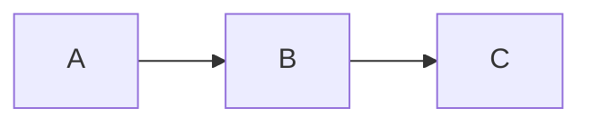

# Prompt 01 — Planificación y creación del portfolio

> Prompt utilizado para definir la arquitectura, criterios visuales y funcionamiento inicial de la SPA documental.

---

# Crear SPA documental dinámica para GitHub Pages y Vercel

Quiero transformar este repositorio de GitHub en una **SPA documental/académica estática**, que funcione tanto en **GitHub Pages** como en **Vercel**, utilizando GitHub como fuente de contenido.

El objetivo no es crear una landing page comercial ni un portfolio genérico. Quiero construir una **interfaz editorial/documental minimalista, técnica y académica**, donde el contenido principal provenga dinámicamente de archivos Markdown del propio repositorio.

---

## 1. Contexto académico

La página representa mi trabajo para:

- **Materia:** Desarrollo de Sistemas Web (Front End)
- **Siglas / comisión:** `DSWF_2A_2C26`
- **Institución:** ISTF N°19
- **Alumno:** Leandro Maselli
- **GitHub:** `leoroan`

La página debe incluir como texto introductorio:

> GitHub como base de trabajo, aquí reúno el código, el proceso y las decisiones de cada proyecto. Este es el lugar desde el que voy a compartir mis entregas y, más adelante, publicar mi trabajo.

No agregar información académica que no haya sido proporcionada.

---

## 2. Objetivo principal

Crear una aplicación web estática con esta estructura mínima:

```text
/
├── index.html
├── style.css
├── app.js
└── README.md
```

No utilizar frameworks de frontend como:

- React
- Vue
- Angular
- Svelte
- Next.js
- etc.

La aplicación debe ser:

- HTML5
- CSS
- JavaScript moderno
- ECMAScript Modules si resultan útiles
- SPA
- Mobile-first
- Responsive
- Accesible
- Liviana
- Fácil de mantener
- Fácil de desplegar en GitHub Pages
- Fácil de desplegar en Vercel

No utilizar TypeScript.

---

## 3. Bootstrap

Utilizar **Bootstrap 5.3** como framework visual principal.

Bootstrap debe utilizarse para prácticamente todo el sistema visual:

- layout
- containers
- grid
- spacing
- typography
- responsive behavior
- buttons
- navbar
- tables
- alerts
- badges
- collapse
- utilities
- etc.

Cargar Bootstrap mediante CDN.

Preferir la distribución oficial/minificada y utilizar **SRI cuando corresponda**.

No descargar ni incluir Bootstrap localmente salvo que exista una razón técnica justificada.

---

## 4. CSS propio

El CSS personalizado debe ser **mínimo**.

No crear un segundo framework CSS sobre Bootstrap.

Utilizar `style.css` solamente para:

- identidad visual;
- pequeñas modificaciones sobre Bootstrap;
- estilos específicos del contenido Markdown;
- detalles de layout que Bootstrap no resuelva adecuadamente;
- mejoras de legibilidad;
- pequeños detalles responsive.

Evitar:

- grandes cantidades de CSS;
- componentes visuales innecesarios;
- gradients excesivos;
- sombras exageradas;
- animaciones decorativas;
- efectos visuales gratuitos;
- glassmorphism;
- backgrounds complejos;
- diseños típicos generados automáticamente por IA.

La estética debe ser:

- minimalista;
- sobria;
- técnica;
- académica;
- moderna;
- limpia;
- altamente legible;
- detallada sin ser recargada.

Utilizar una paleta de colores estándar y profesional. No necesito colores extravagantes.

---

## 5. Concepto visual

La página debe parecer una **documentación técnica académica cuidadosamente diseñada**, no una landing page comercial.

Evitar deliberadamente el patrón:

```text
gradient
+
card
+
shadow
+
icon
+
gradient
+
card
```

No convertir cada sección en una card.

El contenido debe tener aire, jerarquía y estructura editorial.

La prioridad visual debe ser:

1. Legibilidad.
2. Contenido.
3. Navegación.
4. Jerarquía.
5. Identidad académica.
6. Detalles visuales.

No al revés.

---

## 6. Estructura general

La SPA debe tener aproximadamente esta estructura:

```text
┌─────────────────────────────────────────────┐
│ NAVBAR                                      │
│                                             │
│ DSWF_2A_2C26             Inicio · Proyectos │
├─────────────────────────────────────────────┤
│                                             │
│ HERO / IDENTIFICACIÓN                       │
│                                             │
│ Desarrollo de Sistemas Web                  │
│ (Front End)                                 │
│                                             │
│ ISTF N°19                                   │
│ Leandro Maselli · @leoroan                  │
│                                             │
│ texto introductorio                         │
│                                             │
├─────────────────────────────────────────────┤
│                                             │
│ CONTENIDO                                   │
│                                             │
│ README.md renderizado                       │
│                                             │
├─────────────────────────────────────────────┤
│                                             │
│ FOOTER                                      │
└─────────────────────────────────────────────┘
```

La estructura puede modificarse si existe una solución mejor, pero debe conservarse la intención general.

---

## 7. GitHub como fuente de verdad

Esta es una condición fundamental.

**No duplicar el contenido del README dentro de `index.html`.**

El README debe permanecer como fuente de contenido.

La aplicación debe obtener dinámicamente el Markdown desde GitHub y renderizarlo dentro de `<main>`.

Conceptualmente:

```text
GitHub
   │
   │ README.md
   ▼
fetch()
   │
   ▼
Markdown
   │
   ▼
GFM renderer
   │
   ▼
HTML
   │
   ▼
<main>
```

De esta forma:

```text
editar README.md
       ↓
git commit
       ↓
git push
       ↓
GitHub
       ↓
la SPA obtiene el README actualizado
       ↓
la página cambia
```

No debe ser necesario modificar `index.html`, `style.css` o `app.js` para actualizar el contenido documental.

---

## 8. GitHub Flavored Markdown

El Markdown debe interpretarse como **GitHub Flavored Markdown (GFM)**.

La solución debe soportar, en la medida técnicamente viable:

- headings;
- párrafos;
- emphasis;
- strong;
- links;
- imágenes;
- listas;
- listas ordenadas;
- checklists;
- tablas;
- blockquotes;
- código inline;
- fenced code blocks;
- syntax highlighting;
- strikethrough;
- autolinks;
- footnotes;
- HTML permitido por GitHub;
- GitHub Alerts;
- `<details>`;
- `<summary>`;
- etc.

La intención es que un README escrito para GitHub continúe siendo un documento rico cuando se visualiza en esta SPA.

---

## 9. GitHub Alerts

Prestar especial atención a los alerts de GitHub:

```md
> [!NOTE]
> Información adicional.

> [!TIP]
> Recomendación.

> [!IMPORTANT]
> Información importante.

> [!WARNING]
> Advertencia.

> [!CAUTION]
> Precaución.
```

La SPA debe renderizarlos correctamente y darles una presentación visual integrada con Bootstrap.

No crear una implementación visual arbitraria que rompa el contenido.

---

## 10. `<details>` y contenido desplegable

Debe soportarse correctamente:

```html
<details>
  <summary>Información adicional</summary>

  Contenido.
</details>
```

Aprovechar Bootstrap cuando sea apropiado, pero no romper el HTML original del Markdown.

---

## 11. Código fuente

Los bloques de código deben visualizarse correctamente.

Idealmente deben tener:

- tipografía monoespaciada;
- contraste adecuado;
- scroll horizontal cuando sea necesario;
- buena visualización en móviles;
- diferenciación clara entre código inline y bloques de código.

Si se incorpora syntax highlighting, utilizar una solución ligera y justificarla.

No introducir una dependencia pesada simplemente para colorear unas pocas líneas de código.

---

## 12. Mermaid

Investigar si es conveniente soportar diagramas Mermaid.

Si se implementa, debe funcionar con:

````md

````

Pero existe una condición:

**No cargar Mermaid si no es necesario.**

Si la solución puede hacer lazy-load de Mermaid solamente cuando el README contiene bloques Mermaid, hacerlo.

La prioridad es:

```text
funcionalidad
>
peso de descarga
```

---

## 13. Sanitización y seguridad

Como el contenido Markdown termina convertido en HTML, analizar cuidadosamente el riesgo de XSS.

No insertar contenido obtenido de GitHub utilizando `innerHTML` sin sanitización cuando exista riesgo.

Debe existir una estrategia explícita para:

- sanitización;
- HTML permitido;
- enlaces;
- imágenes;
- contenido externo;
- scripts;
- atributos peligrosos.

No deshabilitar la sanitización simplemente para "hacer funcionar" alguna característica.

---

## 14. Imágenes y recursos relativos

Un README puede contener:

```md

```

o:

```md

```

La SPA debe resolver correctamente los recursos relativos.

Si el README pertenece a:

```text
main
```

debe resolverse contra la ubicación correspondiente de ese branch.

Si pertenece a otra branch, debe utilizarse esa branch como contexto.

Conceptualmente:

```text
README:
./images/example.png

↓

https://raw.githubusercontent.com/OWNER/REPO/BRANCH/images/example.png
```

No asumir que todos los recursos estarán en `main`.

---

## 15. Links relativos

Los links relativos del Markdown también deben funcionar correctamente.

Ejemplo:

```md
[Documentación](./docs/documentacion.md)
```

Resolverlos según:

```text
repository
+
branch
+
ruta actual
```

Los links que apuntan a recursos externos deben continuar funcionando como enlaces externos.

---

## 16. SPA y Hash Routing

La aplicación debe ser una verdadera SPA.

No debe recargar completamente la página al navegar entre secciones o proyectos.

Utilizar preferentemente **Hash Routing** para maximizar la compatibilidad con GitHub Pages y Vercel:

```text
/#/inicio
/#/proyecto-01
/#/proyecto-02
```

en lugar de depender de rutas del servidor.

---

## 17. Branches como proyectos

La arquitectura debe permitir que diferentes branches representen distintos proyectos:

```text
main
 └── README.md

proyecto-01
 └── README.md

proyecto-02
 └── README.md

proyecto-03
 └── README.md
```

La SPA debe poder cargar el README de `main` o de cualquier branch configurada sin abandonar la aplicación.

---

## 18. Configuración de proyectos

Crear una pequeña configuración en `app.js`, por ejemplo:

```js
const CONFIG = {
  github: {
    owner: "leoroan",
    repository: "NOMBRE_DEL_REPOSITORIO",
    defaultBranch: "main",
  },

  course: {
    name: "Desarrollo de Sistemas Web (Front End)",
    code: "DSWF_2A_2C26",
    institution: "ISTF N°19",
    student: "Leandro Maselli",
    github: "leoroan",
  },

  projects: [
    {
      id: "inicio",
      branch: "main",
      title: "Inicio",
      readme: "README.md",
    },
  ],
};
```

El nombre real del repositorio debe obtenerse del contexto del proyecto si está disponible.

Si no es posible determinarlo automáticamente, dejar un único placeholder claramente identificado.

No inventar el nombre.

---

## 19. Arquitectura JavaScript

Aunque inicialmente solo existan:

```text
index.html
style.css
app.js
```

mantener `app.js` organizado internamente.

Separar conceptualmente:

```text
CONFIG
GitHub API / fetching
Markdown rendering
URL / routing
DOM rendering
navigation
error handling
bootstrap initialization
```

Evitar un único bloque monolítico de JavaScript.

Utilizar funciones pequeñas y con responsabilidades claras.

No utilizar código innecesariamente complejo.

---

## 20. GitHub API

Analizar la mejor estrategia para obtener el README.

Considerar como mínimo:

### Alternativa A

Obtener directamente:

```text
raw.githubusercontent.com
```

y procesarlo localmente.

### Alternativa B

Utilizar la API de GitHub para obtener/renderizar Markdown utilizando GFM.

Comparar ambas alternativas brevemente y elegir la más apropiada considerando:

- repositorio público;
- GitHub Pages;
- Vercel;
- bajo consumo;
- simplicidad;
- estabilidad;
- GFM;
- límites de API.

No utilizar autenticación si no es necesaria.

No introducir tokens ni secretos.

---

## 21. Cache

Evitar requests innecesarios.

Implementar una estrategia sencilla de cache en memoria o `sessionStorage`/`localStorage` si resulta apropiado.

No permitir que una cache agresiva impida visualizar rápidamente una actualización reciente del README.

---

## 22. Estados de la interfaz

Contemplar como mínimo:

### Loading

```text
Cargando documentación...
```

Utilizar componentes o utility classes de Bootstrap.

### Error

```text
No fue posible cargar la documentación.
```

Mostrar información útil sin exponer errores internos innecesarios.

### README inexistente

Diferenciar, si es posible:

```text
El branch existe pero no contiene README.md.
```

### Branch inexistente

Mostrar:

```text
No se encontró el proyecto solicitado.
```

---

## 23. Responsive / Mobile-first

Diseñar desde mobile-first.

La aplicación debe funcionar correctamente en:

- teléfonos;
- tablets;
- notebooks;
- desktops;
- monitores grandes.

Prestar especial atención a:

- tablas Markdown;
- bloques de código;
- imágenes;
- Mermaid;
- navbar;
- headings largos;
- listas;
- `<details>`;
- contenido con links extensos.

Nunca permitir que un bloque de código o tabla rompa horizontalmente todo el viewport.

---

## 24. Accesibilidad

Aplicar buenas prácticas:

- HTML semántico;
- headings jerárquicos;
- navegación accesible;
- `aria-*` solamente cuando sean necesarios;
- contraste adecuado;
- focus visible;
- botones reales para acciones;
- enlaces reales para navegación;
- imágenes con `alt`;
- respetar `prefers-reduced-motion`.

No agregar ARIA innecesariamente.

---

## 25. SEO básico

Implementar:

- `<title>`;
- meta description;
- viewport;
- Open Graph básico si corresponde;
- idioma `es`;
- HTML semántico.

El título debería identificar:

```text
Desarrollo de Sistemas Web — Leandro Maselli
```

o una variante equivalente.

---

## 26. GitHub / enlace externo

Debe existir una referencia visible a:

```text
GitHub
@leoroan
```

El enlace debe llevar al perfil correspondiente.

No inventar URLs adicionales.

---

## 27. Footer

El footer debe ser discreto.

Puede contener:

```text
DSWF_2A_2C26 · ISTF N°19 · Leandro Maselli
```

y un enlace a GitHub.

No llenar el footer de información innecesaria.

---

## 28. Performance

La aplicación debe priorizar carga rápida.

Evitar:

- frameworks;
- dependencias innecesarias;
- imágenes grandes;
- fuentes externas innecesarias;
- librerías duplicadas;
- JavaScript innecesario;
- CSS innecesario.

Preferir:

```text
Bootstrap CDN
+
JavaScript vanilla
+
renderer GFM apropiado
+
lazy loading de funcionalidades pesadas
```

siempre que sea técnicamente viable.

No agregar una dependencia solamente porque facilita una tarea trivial.

---

## 29. No romper GitHub Markdown

El README debe seguir siendo válido como README de GitHub.

La SPA debe funcionar como una **segunda representación del mismo documento**.

No modificar el README para adaptarlo artificialmente a la SPA salvo que sea estrictamente necesario.

No introducir sintaxis propietaria de la aplicación cuando pueda evitarse.

---

## 30. Compatibilidad GitHub Pages / Vercel

La aplicación debe funcionar como sitio estático.

No utilizar:

- servidor Node;
- backend;
- API propia;
- server-side rendering;
- build obligatorio;

salvo que exista una justificación técnica excepcional.

Debe poder publicarse sirviendo:

```text
index.html
style.css
app.js
```

en GitHub Pages y también desplegarse directamente en Vercel.

---

## 31. Validación

Antes de finalizar:

1. Revisar HTML.
2. Revisar JavaScript.
3. Revisar CSS.
4. Comprobar Bootstrap.
5. Comprobar obtención del README.
6. Comprobar GFM.
7. Comprobar tablas.
8. Comprobar código.
9. Comprobar imágenes.
10. Comprobar links.
11. Comprobar alerts.
12. Comprobar `<details>`.
13. Comprobar navegación SPA.
14. Comprobar cambio de branch.
15. Comprobar responsive.
16. Comprobar errores de red.
17. Comprobar que no existen secretos.
18. Comprobar dependencias.
19. Comprobar funcionamiento como sitio estático.
20. Comprobar que no se duplicó contenido del README en HTML.

---

## 32. Regla fundamental de implementación

### Primero

Inspeccionar el repositorio actual.

Determinar:

- nombre real del repositorio;
- estructura actual;
- contenido de `README.md`;
- branches existentes;
- archivos existentes;
- si ya existe alguna página;
- si existen assets;
- si existe configuración de Vercel/GitHub Pages;
- si existe código que deba conservarse.

### Segundo

Proponer brevemente la arquitectura concreta.

### Tercero

Implementar.

### Cuarto

Revisar el resultado y corregir problemas.

No borrar archivos existentes sin comprobar previamente si son necesarios.

No sobrescribir contenido existente arbitrariamente.

---

## 33. Restricciones importantes

### No

- usar React;
- usar TypeScript;
- usar Tailwind;
- usar jQuery;
- crear un backend;
- duplicar el README en HTML;
- inventar información académica;
- inventar proyectos;
- inventar branches;
- agregar animaciones innecesarias;
- convertir todo en cards;
- agregar gradients por defecto;
- llenar la página de iconos;
- utilizar librerías grandes sin justificación;
- introducir secretos o tokens de GitHub.

### Sí

- HTML semántico;
- Bootstrap 5.3;
- JavaScript vanilla;
- GFM;
- SPA;
- mobile-first;
- GitHub como fuente de verdad;
- branches como proyectos;
- código simple;
- arquitectura clara;
- performance;
- accesibilidad;
- diseño editorial/técnico.

---

## 34. Criterio de diseño

El resultado final debe transmitir:

> "Este es el repositorio académico de un desarrollador que documenta su trabajo."

No debe transmitir:

> "Esta es una landing page generada por una IA."

Priorizar el contenido sobre la decoración.

La interfaz debe sentirse deliberada, sobria y profesional.

---

## 35. Resultado esperado

Al terminar, el repositorio debe poder funcionar como:

```text
Repositorio GitHub
       │
       ├── código
       ├── commits
       ├── branches
       └── README.md
               │
               ▼
          SPA documental
               │
       ┌───────┴────────┐
       ▼                ▼
GitHub Pages          Vercel
```

La experiencia esperada:

```text
Abrir sitio
   ↓
ver identidad académica
   ↓
ver navegación
   ↓
leer README.md
   ↓
navegar a otros proyectos
   ↓
la SPA carga el README de la branch correspondiente
   ↓
todo sin recargar la aplicación
```

La **fuente de verdad debe seguir siendo GitHub**.

Si mañana modifico:

```text
README.md
```

y hago:

```bash
git add .
git commit
git push
```

la documentación que muestra la SPA debe reflejar ese cambio sin tener que copiar manualmente el contenido al HTML.

---

## 36. Entrega

Al finalizar, mostrar:

1. Estructura final de archivos.
2. Código implementado.
3. Dependencias externas utilizadas.
4. Justificación breve de las decisiones técnicas importantes.
5. Cómo probarlo localmente.
6. Cómo publicarlo en GitHub Pages.
7. Cómo publicarlo en Vercel.
8. Limitaciones conocidas.
9. Qué partes podrían extenderse posteriormente.

No crear funcionalidades futuras que no sean necesarias para esta primera versión.

La prioridad es entregar una **base pequeña, sólida y extensible**.
