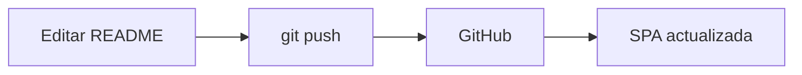

# DSWF_2A_2C26_Desarrollo-de-Sistemas-Web-Front-End-

GitHub como base de trabajo, aquí reúno el código, el proceso y las decisiones de cada proyecto. Este es el lugar desde el que voy a compartir mis entregas y, más adelante, publicar mi trabajo.

---

## Sobre este repositorio

Este repositorio funciona como **fuente de contenido** de una SPA documental estática. El `README.md` de cada branch se renderiza automáticamente en la interfaz web, de modo que editar el Markdown y hacer _push_ es suficiente para actualizar el sitio.

### Estructura

```text
/
├── index.html   # Estructura de la SPA
├── style.css    # Estilos propios (mínimos, sobre Bootstrap 5.3)
├── app.js       # Lógica de la SPA (config, fetch, renderizado, routing)
└── README.md    # Este archivo: contenido principal
```

### Cómo se agrega un proyecto

Cada proyecto es una **branch** del repositorio. Para agregar uno:

1. Crear una branch con el nombre del proyecto.
2. Agregar (o editar) su `README.md`.
3. Registrar el proyecto en `CONFIG.projects` dentro de `app.js`:

```js
{
  id: "proyecto-01",
  branch: "proyecto-01",
  title: "Proyecto 01",
  readme: "README.md"
}
```

### Características

- **SPA** con hash routing (`#/inicio`), compatible con GitHub Pages y Vercel.
- **GFM** (GitHub Flavored Markdown) con `marked` + sanitización con `DOMPurify`.
- **GitHub Alerts** con estilos de Bootstrap.
- **Syntax highlighting** con `highlight.js` (carga diferida).
- **Mermaid** para diagramas (carga diferida, solo si se usa).
- **Responsive** y **mobile-first** con Bootstrap 5.3.
- **Sin frameworks** de frontend: HTML5 + CSS + JavaScript vanilla.

> [!NOTE]
> Este es un ejemplo de alerta de tipo _Nota_.

> [!TIP]
> Los bloques de código, tablas y diagramas se renderizan correctamente.

> [!IMPORTANT]
> El contenido de este README se obtiene dinámicamente desde GitHub.

> [!WARNING]
> No editar `index.html` para cambiar contenido; usar el Markdown.

> [!CAUTION]
> Cuidado con los secretos: este repositorio es público.

### Tablas

| Característica | Estado |
| -------------- | ------ |
| GFM            | ✅     |
| Alerts         | ✅     |
| Mermaid        | ✅     |
| Highlight      | ✅     |

### Código

```javascript
const saludo = "Hola, mundo";
console.log(saludo);
```

### Diagrama Mermaid



### Detalles

<details>
<summary>Ver más información</summary>

Este contenido está dentro de una etiqueta `<details>` y se puede desplegar.

- Ítem 1
- Ítem 2
- Ítem 3

</details>

---

## Licencia

Sin licencia específica. Uso académico.
